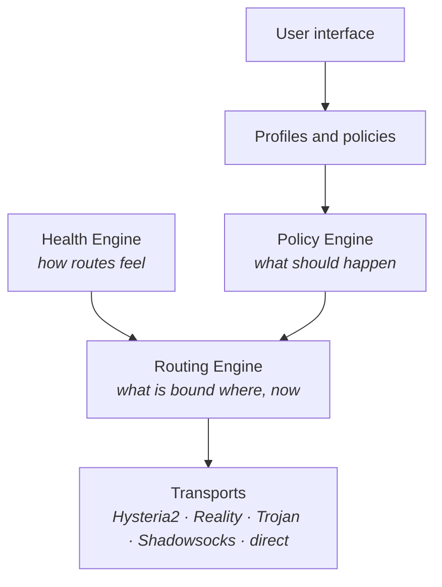

# Method

**A VPN client that decides for itself which way to send your traffic.**

[Русский](README.md) · **English**

---

## What this is

A client for **your own** servers. No bundled subscriptions, no third-party
nodes: paste your links or a subscription URL and it works.

Supports **Hysteria2**, **VLESS + Reality** (Vision and gRPC), **Trojan**
and **Shadowsocks-2022**.

There are many such clients. Method differs in one way: it does not connect to
a server — it **maintains a state of the network**.

## Why not just another client

Every existing client asks you to pick a **server** and ranks servers by
latency. Both are wrong. Here is a measurement from our own nodes — eight
rounds of 20 requests through each tunnel, zero failures:

| Node | Transport | Median | p95 | Jitter |
|---|---|---:|---:|---:|
| Finland | Reality gRPC | **65 ms** | 135 ms | 19 ms |
| Finland | Reality Vision | **209 ms** | 652 ms | 125 ms |
| USA | Hysteria2 | 143 ms | 150 ms | 3 ms |
| USA | Reality gRPC | 143 ms | 150 ms | **1 ms** |
| USA | Reality Vision | 415 ms | 906 ms | 61 ms |
| USA | Trojan | 417 ms | 944 ms | 32 ms |

Look at the first two rows. That is **the same server**: same machine, same
uplink, same minute. Only the transport differs — and it costs three times the
latency, five times the tail and six times the jitter.

So "connect to Finland" says almost nothing. The unit of choice is not a node
but a **route**: a node together with a transport. A client that lets you pick
a country and then picks a protocol arbitrarily is picking blind.

One number is not enough either. Two of the US routes have medians identical to
the millisecond — 143 and 143 — and are indistinguishable by latency. Telling a
good route from a mediocre one needs jitter, the tail of the distribution and
handshake time: Trojan's handshake is nearly twice as long as the others, and
for a browser opening dozens of short connections that matters more than
steady-state latency.

Method measures **seven metrics** — latency, jitter, loss, handshake time,
availability, throughput and stability over time — and weighs them **by
workload**. Games care about jitter and loss, downloads about throughput,
browsing about a fast handshake. These are different answers, and a single
"best server" does not exist.

> Measured from a datacentre uplink. On home Wi-Fi and mobile networks the
> absolute numbers will be worse and the spread between routes wider.

## Routes are not interchangeable

The second difference matters more than the first. Every known client treats
outbounds as equivalent and ranks them by one number. But protocols rest on
**different ways through**, and protocols sharing a way die together:

| Way through | Covered by | Killed by |
|---|---|---|
| QUIC over UDP | Hysteria2, TUIC | QUIC filtering |
| HTTP/2 in forged TLS | Reality gRPC | detecting the Reality forgery |
| Bare TCP in forged TLS | Reality Vision | the same |
| Genuine TLS | Trojan | only blocking the domain or IP |
| Encrypted stream, no handshake | Shadowsocks-2022 | none of the above |

A network can pass UDP and still kill QUIC — we measured it. In such a network,
switching from Hysteria2 to TUIC achieves **nothing**: both sit on the same way
through. Method knows this and fails over to a different way, not to a
neighbouring protocol.

## How it works

The core configuration describes not servers but **lanes** — gaming, streaming,
browsing, bulk, sensitive, direct. Rules mapping "application, domain or port →
lane" are compiled once. The binding "lane → node" changes at runtime,
**without tearing down the tunnel or dropping connections**.

That is why failover is invisible: it is a rebinding, not a reconnect.

## Status

This repository has just been opened. Honestly: **there is no working code here
yet** — the client is being moved over from private development, and the
orchestrator engine is being designed.

| Platform | Client | Orchestrator |
|---|---|---|
| macOS | moving in | in progress |
| Android | moving in | after macOS |
| Windows 10/11 | moving in | after Android |
| iOS | planned | — |

Commits and issues are the best way to follow along.

## Building

Instructions will arrive with the code. Building requires the
[sing-box](https://github.com/SagerNet/sing-box) core, which is **not part of**
this repository and is fetched separately (see the licence section).

## Copyright

Copyright (C) 2026 Kovalyov Georgiy — see [COPYRIGHT](COPYRIGHT).

## Licence

Method's code is distributed under the **GNU GPL version 3 or later** — see
[LICENSE](LICENSE).

Method uses the [sing-box](https://github.com/SagerNet/sing-box) core, running
it as a **separate process** and talking to it over local HTTP. The core is not
part of this repository and is downloaded at build or first run. sing-box is
distributed under its own terms; its authors have no connection to this project,
and this project is not affiliated with them in any way.

## Standing on shoulders

Network behaviour policies and route groups are not a new idea:
[Mihomo](https://github.com/MetaCubeX/mihomo), Surge and
[Psiphon](https://github.com/Psiphon-Labs/psiphon-tunnel-core) have implemented
versions of it. Method borrows from them openly and says so. What is new here is
choosing a route by its way through the censor, not by the node's latency.
