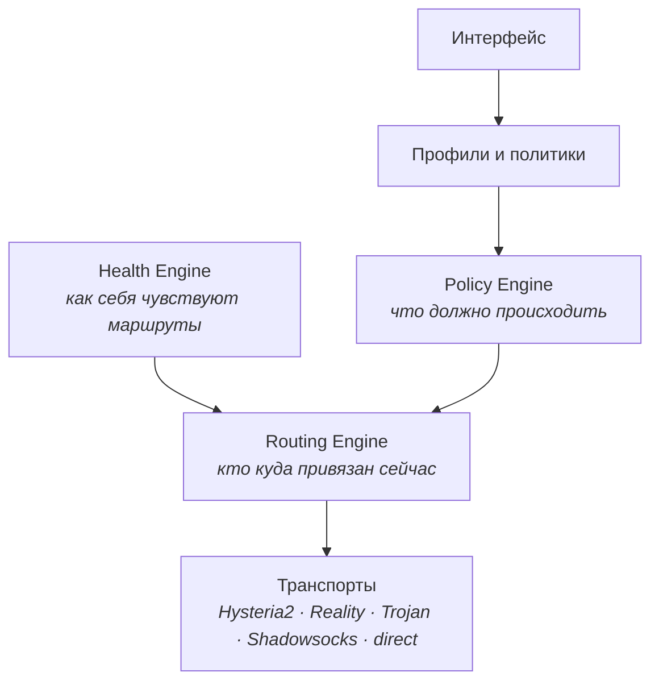

# Method

**VPN-клиент, который сам решает, каким путём вести трафик.**

**Русский** · [English](README.en.md)

---

## Что это

Клиент для **ваших собственных** серверов. Никаких встроенных подписок и чужих
узлов: вставляете свои ссылки или адрес подписки — и работает.

Поддерживаются **Hysteria2**, **VLESS + Reality** (Vision и gRPC), **Trojan**
и **Shadowsocks-2022**.

Таких клиентов много. Отличие Method в одном: он не подключается к серверу —
он **поддерживает состояние сети**.

## Почему не «ещё один клиент»

Все существующие клиенты выбирают сервер по задержке. Это неверно, и вот
замер с наших собственных узлов — один круг, по 20 запросов через туннель:

| Маршрут | Медиана | p95 | Разброс |
|---|---:|---:|---:|
| Финляндия · gRPC | **76 мс** | 579 мс | ×7.6 |
| США · gRPC | 138 мс | 141 мс | ×1.02 |

Выбор по пингу возьмёт Финляндию: она вдвое быстрее. Но её хвост — 579 мс
против 141. Для игры, звонка или видеозвонка это заметно худший маршрут,
несмотря на вдвое лучшую медиану. Клиент, который смотрит на одно число,
систематически выбирает не то.

Method считает **семь метрик** — задержку, джиттер, потери, время рукопожатия,
доступность, полосу и стабильность во времени — и взвешивает их **по типу
нагрузки**. Для игры важны джиттер и потери, для загрузки — полоса, для
браузера — быстрое рукопожатие. Это разные ответы, и одного «лучшего сервера»
не существует.

## Маршруты не взаимозаменяемы

Второе отличие важнее первого. Все известные клиенты считают выходы
равноценными и ранжируют их одним числом. Но протоколы стоят на **разных
способах пройти**, и протоколы на одном способе умирают вместе:

| Способ пройти | Чем закрыт | Чем убивается |
|---|---|---|
| QUIC поверх UDP | Hysteria2, TUIC | фильтрацией QUIC |
| HTTP/2 в поддельном TLS | Reality gRPC | распознаванием подделки Reality |
| Голый TCP в поддельном TLS | Reality Vision | тем же самым |
| Настоящий TLS | Trojan | только блокировкой домена или IP |
| Шифрованный поток без рукопожатия | Shadowsocks-2022 | ничем из перечисленного |

Сеть может пропускать UDP и при этом резать QUIC — проверено. В такой сети
переключение с Hysteria2 на TUIC не даёт **ничего**: оба лежат на одном
способе. Method знает об этом и при отказе уходит на другой способ, а не на
соседний протокол.

## Как это устроено

Конфигурация ядра описывает не серверы, а **полосы** — «игры», «стриминг»,
«браузер», «загрузки», «чувствительное», «напрямую». Правила «приложение,
домен или порт → полоса» компилируются один раз. А привязка «полоса → узел»
меняется на лету, **не разрывая туннель и не обрывая соединения**.

Именно поэтому переключение при деградации незаметно: это не переподключение,
а смена привязки.

## Состояние

Репозиторий только что открыт. Честно: **готового кода здесь пока нет** —
клиент переезжает сюда из приватной разработки, а движок оркестратора
проектируется.

| Платформа | Клиент | Оркестратор |
|---|---|---|
| macOS | переезжает | в работе |
| Android | переезжает | после macOS |
| Windows 10/11 | переезжает | после Android |
| iOS | планируется | — |

Следить за ходом работ удобнее всего по коммитам и задачам.

## Сборка

Появится вместе с кодом. Для сборки понадобится ядро
[sing-box](https://github.com/SagerNet/sing-box) — оно **не входит** в этот
репозиторий и загружается отдельно (см. раздел о лицензии).

## Лицензия

Код Method распространяется на условиях **GNU GPL версии 3 или более поздней** —
см. [LICENSE](LICENSE).

Method использует ядро [sing-box](https://github.com/SagerNet/sing-box),
запуская его **отдельным процессом** и общаясь с ним по локальному HTTP.
Ядро не входит в этот репозиторий и загружается при первой сборке или запуске.
sing-box распространяется на своих условиях; его авторы к этому проекту
отношения не имеют, и проект никак с ними не аффилирован.

## На чьих плечах

Идея политик поведения сети и групп маршрутов не нова: её в разных видах
реализовали [Mihomo](https://github.com/MetaCubeX/mihomo), Surge и
[Psiphon](https://github.com/Psiphon-Labs/psiphon-tunnel-core). Method
заимствует у них честно и говорит об этом прямо. Новое здесь — выбор маршрута
по способу обхода, а не по задержке узла.
